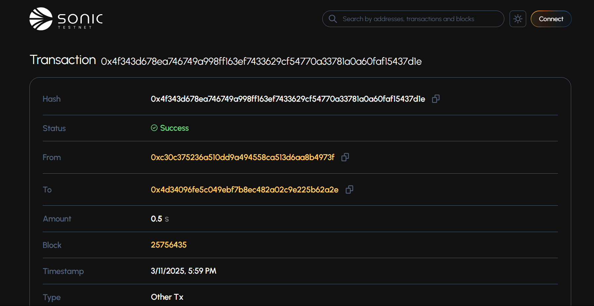
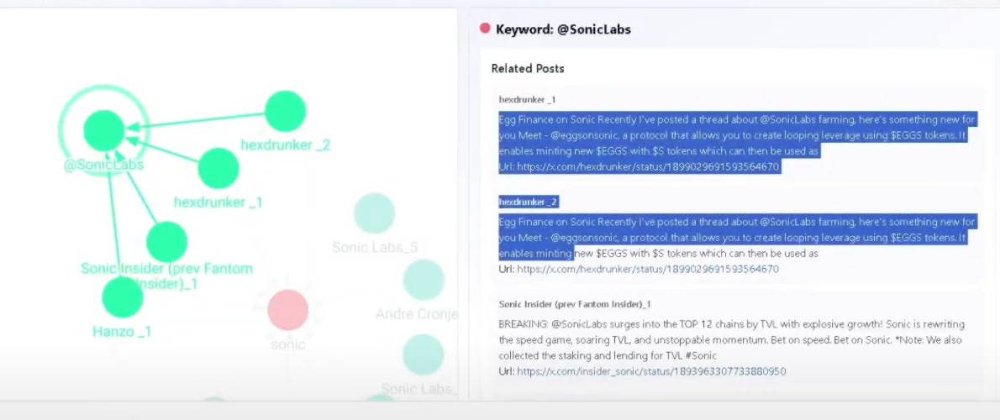
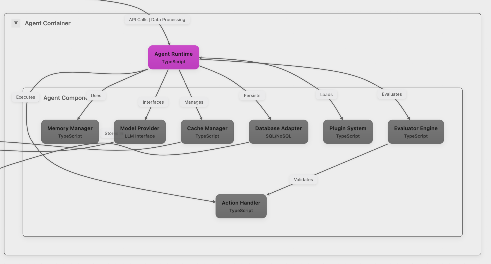

# FlyFish Sonic Plugin

## Overview
FlyFish Sonic Plugin is a comprehensive blockchain integration module designed to provide seamless interaction with the Sonic blockchain ecosystem. It offers a robust set of features for wallet management, decentralized finance (DeFi) operations, and advanced blockchain analytics.

# Table of Contents
- [FlyFish Sonic Plugin](#flyfish-sonic-plugin)
  - [Overview](#overview)
- [Table of Contents](#table-of-contents)
- [Project structure](#project-structure)
  - [Response Format](#response-format)
  - [Core Capabilities](#core-capabilities)
    - [Create Bounty](#create-bounty)
    - [Sonic Integration](#sonic-integration)
    - [Get insights from data](#get-insights-from-data)
  - [Architecture](#architecture)

# Project structure
```
characters/
├── agent-sonic/          # Agent Sonic
packages/
├── plugin-sonic/          # Core Sonic protocol integration
├───────────────src/
├───────────────────/actions/
├───────────────────────────/createBounty.ts
├───────────────────────────/checkBounty.ts
├───────────────────────────/giveInsights.ts
├───────────────────/services/
├────────────────────────────/sonicServices.ts
├────────────────────────────/pinataServices.ts
├───────────────────/utils/
├───────────────────/types/
├───────────────────/config/
├───────────────────/index.ts
├───────────────────/package.json
├───────────────────/README.md
└── client-direct/        # Direct client implementation
```

### Sonic Services
- `create()`: Create new bounty
- `findAll()`: Get all bounties
- `findById()`: Get bounty by ID
- `participateInBounty()`: Join a bounty
- `getBontyParticipants()`: Get bounty participants
- `distributeRewards()`: Distribute bounty rewards

### Agent call contract
#### Create Bounty
Calling the Smart Contract: The actual interaction with the smart contract occurs in this line:
```
   const transaction = await sonicServices.create(
       bountyId,
       bountyId,  // using bountyId (IPFS hash) as dataRefer
       stakingAmount,
       minimumOfUser,
       expireTime
   );
```
- Here, sonicServices.create is a method that likely encapsulates the logic for calling the smart contract's create function.
The parameters passed to this method include:
- bountyId: The IPFS hash of the bounty data.
- stakingAmount: The amount of tokens that users need to stake to participate in the bounty.
- minimumOfUser: The minimum number of users required to fulfill the bounty.
- expireTime: The duration for which the bounty is valid.


#### Participate In Bounty
If the submission qualifies for the bounty, the agent calls the smart contract to submit the evaluation result. This is done using the sonicServices.participateInBounty method, which interacts with the smart contract to record the user's participation based on the evaluation score.
```
   const result = await sonicServices.participateInBounty(
       walletAddress,
       point,
       bountyId
   );
```

#### Distribute Rewards
The agent calls the smart contract to distribute rewards to the participants. This is done using the sonicServices.distributeRewards method, which interacts with the smart contract to distribute the rewards based on the evaluation scores.
```
   const result = await sonicServices.distributeRewards(
       bountyId,
       rewardAmount
   );
```

### Knowledge Graph



## Architecture
